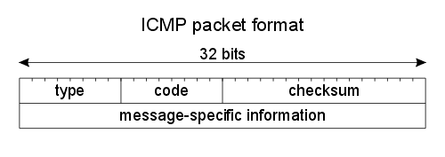

#
```
Network Types: LAN, WAN, PAN, CAN, MAN, SAN, WLAN
https://www.youtube.com/watch?v=4_zSIXb7tLQ
```
```
Network Topologies (Star, Bus, Ring, Mesh, Ad hoc, Infrastructure, & Wireless Mesh Topology)
https://www.youtube.com/watch?v=zbqrNg4C98U
```

```
What is a DMZ? (Demilitarized Zone)
https://www.youtube.com/watch?v=dqlzQXo1wqo
```
```
NAT Explained - Network Address Translation
https://www.youtube.com/watch?v=FTUV0t6JaDA
```
# 網路硬體
```
Layer-1 : repeater(1-1), hub(1-N)
Layer-2 : bridgr, switch
Layer-3 : router,L3-Switch
Layer-4 : L4 switch
Layer-7 : L7 switch, proxy
```
# IEEE 802
```
● IEEE 802 指IEEE標準中關於區域網路和都會網路的一系列標準。更確切的說，IEEE 802標準僅限定在傳輸可變大小封包的網路。
  其中最廣泛使用的有乙太網路、權杖環、無線區域網路等。這一系列標準中的每一個子標準都由委員會中的一個專門工作群組負責。

● IEEE 802中定義的服務和協定限定在OSI模型的最低兩層（即實體層和資料鏈路層）。
  事實上，IEEE 802將OSI的資料鏈路層分為兩個子層，分別是邏輯鏈路控制（LLC, Logical Link Control）和媒介存取控制
 （MAC, Media Access Control），如下所示：
● 資料鏈路層
●   邏輯鏈路控制子層
●   媒介存取控制子層
● 實體層

現有標準
IEEE 802.1：高層區域網路協定（Bridging (networking) and Network Management）
IEEE 802.2：邏輯鏈路控制（Logical link control）

IEEE 802.3：乙太網路（Ethernet）
IEEE 802.4：權杖匯流排（Token bus）
IEEE 802.5：權杖環（Token-Ring）
IEEE 802.6：城域網（MAN, Metropolitan Area Network）
IEEE 802.7：寬頻TAG（Broadband LAN using Coaxial Cable）
IEEE 802.8：光纖分散式資料介面（FDDI）
IEEE 802.9：綜合業務區域網路（Integrated Services LAN）
IEEE 802.10：區域網路網路安全（Interoperable LAN Security）
IEEE 802.11：無線區域網路（Wireless LAN & Mesh）
IEEE 802.12：需求優先級（Demand priority）
IEEE 802.13：（未使用）
IEEE 802.14：電纜數據機（Cable modems）
IEEE 802.15：無線個人區域網路（Wireless PAN）
IEEE 802.15.1：無線個人區域網路絡（WPAN, Wireless Personal Area Network）
IEEE 802.15.4：低速無線個人區域網路絡（LR-WPAN, Low Rate Wireless Personal Area Network）
IEEE 802.16：寬頻無線接入（Broadband Wireless Access）
IEEE 802.17：彈性封包環傳輸技術（Resilient packet ring）
IEEE 802.18：無線電管制技術（Radio Regulatory TAG）
IEEE 802.19：共存標籤（Coexistence TAG）
IEEE 802.20：移動寬頻無線接入（Mobile Broadband Wireless Access）
IEEE 802.21：媒介獨立換手（Media Independent Handover）
IEEE 802.22：無線區域網（Wireless Regional Area Network）
IEEE 802.23：緊急服務工作群組（Emergency Services Working Group），2010年3月新發布
```
# 網路協定:

#### OSI 
```
應用層 Application 

表達層 Presentation

會議層 Session 

傳輸層

OSI Model Explained | OSI Animation | Open System Interconnection Model | OSI 7 layers | TechTerms
https://www.youtube.com/watch?v=vv4y_uOneC0
```
### ARP
```
Address Resolution Protocol (ARP) - Explained with example | Computer network | TechTerms
https://www.youtube.com/watch?v=EC1slXCT3bg

MAC Address
```
### ICMP
```
Internet Control Message Protocol

● ICMP 在溝通之中，主要是透過不同的類別( Type )與代碼( Code ) 讓機器來識別不同的連線狀況。常用的類別如下表所列﹕

類別	名稱	代表意思
0	Echo Reply	是一個回應信息。
3	Distination Unreachable	表示目的地不可到達。
4	Source Quench	當 router 負載過時﹐用來竭止來源繼續發送訊息。
5	Redirect	用來重新導向路由路徑。
8	Echo Request	請求回應訊息。
11	Time Exeeded for a Datagram	當資料封包在某些路由現象中逾時﹐告知來源該封包已被忽略忽略。
12	Parameter Problem on a Datagram	當一個 ICMP 封包重複著之前的錯誤時﹐會回覆來源主機關於參數錯誤的訊息。
13	Timestamp Request	要求對方送出時間訊息﹐用以計算路由時間的差異﹐以滿足同步性協定的要求。
14	Timestamp Replay	此訊息純粹是回應 Timestamp Request 用的。
15	Information Request	在 RARP 協定應用之前﹐此訊息是用來在開機時取得網路信息。
16	Information Reply	用以回應 Infromation Request 訊息。
17	Address Mask Request	這訊息是用來查詢子網路 mask 設定信息。
18	Address Mask Reply	回應子網路 mask 查詢訊息的。

● 在 ICMP 使用中﹐不同的類別會以不同的代碼來描述具體的狀況。以 Type 3 ( Distination Unreachable ) 為例，其下的代碼如下所列﹕

代碼	代表意思
0: Network Unreachable（無法到達目的網路）

1: Host Unreachable（無法到達目的主機）

2: Protocol Unreachable（通訊協定不存在）

3: Port Unreachable（無法到達連接埠）

4: Fragmentation Needed and DF set（資料需分割並設定不可分割位元）

5: Source Route Failed（來源路徑選擇失敗）

6: Destination Network Unknown（無法識別目的地網路）

7: Destination Host Unknown（無法識別目的地主機）

8: Source Host Isolated（來源主機被隔離）

9: Communication with Destination Network Administratively Prohibited（管理上禁止和目的地網路通訊）

10: Communication with Destination Host Administratively Prohibited（管理上禁止和目的地主機通訊）

11: Network Unreachable for Type of Service（無法到達此型態的網路服務）

12: Host Unreachable for Type of Service（無法到達此型態的主機服務）
ICMP 是個非常有用的協定﹐尤其是當我們要對網路連接狀況進行判斷的時候。下面讓我們看看常用的 ICMP 實例，以更好了解 ICMP 的功能與作用。

```
#### ICMP Message Format封包格式:


```
ICMP 封包格式，其各欄位功能如下：
● 訊息型態（Message Type）：表示該 ICMP 所欲控制之訊息型態，共有 13 種型態，訊息型態之型態代表值如表 5-2 所示。
● 編碼（Code）：對各種訊息型態進一步說明工作內容。
● 檢查集檢查碼（Checksum）：對該封包檢查集錯誤偵測。
● 訊息說明（Message description）：依照不同的控制訊息，而有不同的說明方式。
```
#### Message Type
```
ICMP 訊息功能

[重要]0  Echo Reply（回應答覆）
[重要]3  Destination Unreachable（目的地無法到達）

4 Source Quench（來源抑制）

[重要]5 Redirect（改變傳輸路徑）

[重要]8 Echo Request（回應要求）

9 Router Advertisement（路由器宣傳）
10 Router Solicitation（路由器懇請）
11 Time Exceeded for a Datagram（溢時傳輸）
12 Parameter Problem on a Datagram（參數問題）
13 Timestamp Request（時間標籤要求）
14 Timestamp Reply（時間標籤回覆）
15 Information Request（資訊要求）（停用）
16 Information Reply（資訊回覆）（停用）
17 Address Mask Request（位址遮罩要求）
18 Address Mask Reply（位址遮罩回覆）
```

```
ping 
tracert| Traceroute
(Windows tracert / Linux run)
如何使用 TRACERT 疑難排解 Windows 中的 TCP/IP 問題
https://support.microsoft.com/zh-tw/help/314868/how-to-use-tracert-to-troubleshoot-tcp-ip-problems-in-windows
```
```
tracert www.pchome.com.tw

在上限 30 個躍點上
追蹤 www.pchome.com.tw [210.59.230.39] 的路由:

  1     3 ms    <1 ms     4 ms  172.20.155.254
  2    <1 ms    <1 ms    <1 ms  172.16.190.253
  3    13 ms    <1 ms    <1 ms  120-114-151-14.ksu.edu.tw [120.114.151.14]
  4     *        *        *     要求等候逾時。
  5     *        *        *     要求等候逾時。
  6     *        *        *     要求等候逾時。
  7     *        *        *     要求等候逾時。
  8     *        *        *     要求等候逾時。
  9     *        *        *     要求等候逾時。
 10     *        *        *     要求等候逾時。
```
```
在上限 30 個躍點上
追蹤 www.ksu.edu.tw [120.114.100.65] 的路由:

  1    <1 ms    <1 ms    <1 ms  172.20.155.254
  2    <1 ms    <1 ms    <1 ms  120-114-50-230.ksu.edu.tw [120.114.50.230]
  3    <1 ms    <1 ms    <1 ms  chs.www.ksu.edu.tw [120.114.100.65]

追蹤完成。
```
#### tracert ksu 
```

```
### TCP vs UDP 
```
TCP vs UDP Comparison
https://www.youtube.com/watch?v=uwoD5YsGACg
```


### SSL, TLS, HTTP, HTTPS 
```
SSL, TLS, HTTP, HTTPS Explained
https://www.youtube.com/watch?v=hExRDVZHhig
```

###  Proxy Server
```
What is a Proxy Server?
https://www.youtube.com/watch?v=5cPIukqXe5w
```

### FTP (File Transfer Protocol), SFTP, TFTP Explained.
```
FTP (File Transfer Protocol), SFTP, TFTP Explained.
https://www.youtube.com/watch?v=tOj8MSEIbfA
```
# RFID
```
無線射頻辨識（英語：Radio Frequency IDentification，縮寫：RFID）是一種無線通訊技術，可以通過無線電訊號識別特定目標並讀寫相關數據，而無需識別系統與特定目標之間建立機械或者光學接觸。
```
# TCP
```
● 可靠性 : 能夠確保資料完整的傳輸，確認是否有接收到，封包格式確認，回傳確認(三項交握)
● 不可靠性 : 傳輸過去的資料不管有沒有正確都不會再次確認、回傳(很小的影響或可接性)
```
#### TCP Format
```

```
### DNS
```

```

### DNS
```

```

### DNS
```

```
#### ARP
```
C:\Users\KSUIE>ARP -a

介面: 192.168.57.1 --- 0x4
  網際網路網址          實體位址               類型
  192.168.57.255        ff-ff-ff-ff-ff-ff     靜態
  224.0.0.3             01-00-5e-00-00-03     靜態
  224.0.0.22            01-00-5e-00-00-16     靜態
  224.0.0.251           01-00-5e-00-00-fb     靜態
  224.0.0.252           01-00-5e-00-00-fc     靜態
  239.255.255.250       01-00-5e-7f-ff-fa     靜態

介面: 172.20.155.232 --- 0x6
  網際網路網址          實體位址               類型
  172.20.155.16         88-d7-f6-53-83-c0     動態
  172.20.155.22         88-d7-f6-53-24-ac     動態
  172.20.155.38         88-d7-f6-53-24-9b     動態
  172.20.155.50         88-d7-f6-53-82-e5     動態
  172.20.155.51         88-d7-f6-53-85-b8     動態
  172.20.155.56         38-2c-4a-c6-c6-29     動態
  172.20.155.61         88-d7-f6-53-84-19     動態
  172.20.155.97         88-d7-f6-53-83-4a     動態
  172.20.155.100        88-d7-f6-53-83-98     動態
  172.20.155.102        70-4d-7b-a3-4c-d4     動態
  172.20.155.126        88-d7-f6-53-83-f7     動態
  172.20.155.145        88-d7-f6-53-24-2b     動態
  172.20.155.153        88-d7-f6-53-24-87     動態
  172.20.155.157        70-4d-7b-a3-4d-68     動態
  172.20.155.177        70-4d-7b-a3-4d-b6     動態
  172.20.155.178        38-2c-4a-c6-c2-e6     動態
  172.20.155.181        88-d7-f6-53-25-25     動態
  172.20.155.201        88-d7-f6-53-85-d5     動態
  172.20.155.216        88-d7-f6-53-83-0d     動態
  172.20.155.230        88-d7-f6-53-85-c3     動態
  172.20.155.231        88-d7-f6-53-85-a5     動態
  172.20.155.254        00-14-1b-72-a8-00     動態
  172.20.155.255        ff-ff-ff-ff-ff-ff     靜態
  224.0.0.3             01-00-5e-00-00-03     靜態
  224.0.0.22            01-00-5e-00-00-16     靜態
  224.0.0.251           01-00-5e-00-00-fb     靜態
  224.0.0.252           01-00-5e-00-00-fc     靜態
  239.255.64.75         01-00-5e-7f-40-4b     靜態
  239.255.255.250       01-00-5e-7f-ff-fa     靜態
  255.255.255.255       ff-ff-ff-ff-ff-ff     靜態

介面: 192.168.173.2 --- 0xc
  網際網路網址          實體位址               類型
  192.168.173.255       ff-ff-ff-ff-ff-ff     靜態
  224.0.0.3             01-00-5e-00-00-03     靜態
  224.0.0.22            01-00-5e-00-00-16     靜態
  224.0.0.251           01-00-5e-00-00-fb     靜態
  224.0.0.252           01-00-5e-00-00-fc     靜態
  239.255.255.250       01-00-5e-7f-ff-fa     靜態
```
```


